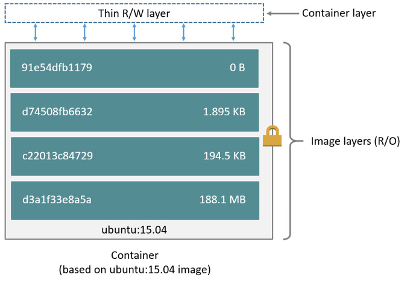
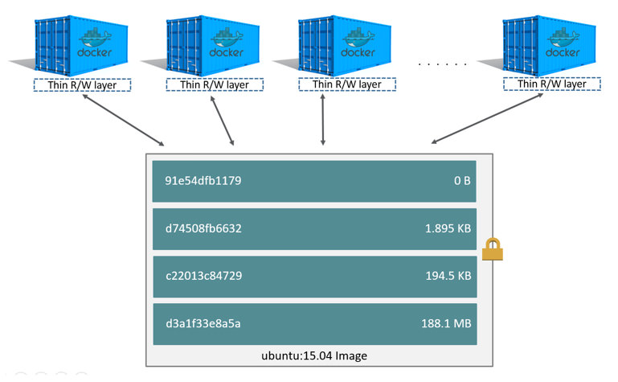

# Storage drivers

Antes de falar de volumes, é importante entender um pouco como as imagens
funcionam, já que um container só existe a partir de uma imagem.

O *storage driver* é o que permite gravar dados na camada de escrita do
container. O ponto central é: **quando o container é removido, tudo que estava
apenas nessa camada de escrita é perdido**. Hoje o driver padrão no Linux é o
`overlay2`.

<a name="images-and-layers"></a>
### Imagens e camadas (layers)

Uma imagem Docker é feita de várias camadas, e cada instrução do Dockerfile que
altera o sistema de arquivos gera uma camada.

Veja o Dockerfile de exemplo:

```dockerfile
FROM alpine:3.20

COPY entrypoint.sh /root/entrypoint.sh

RUN mkdir -p /root/files/readme

CMD ["cat", "/root/entrypoint.sh"]
```

O `FROM` traz as camadas da imagem base; o `COPY` gera uma camada com o arquivo
adicionado; o `RUN` gera outra camada com o diretório criado. (Instruções que
não mexem no filesystem, como `CMD` e `ENV`, só ajustam metadados.)

Essas camadas são empilhadas e são **somente leitura**. Ao iniciar um container,
o Docker adiciona no topo uma camada de escrita fina. Qualquer arquivo que você
modificar dentro do container fica nessa camada de escrita, usando *copy-on-write*.



> Imagem da documentação oficial:
> <https://docs.docker.com/storage/storagedriver/images/container-layers.jpg>

<a name="containers-and-layers"></a>
### Containers e camadas (layers)

A diferença principal entre um container e uma imagem é justamente essa camada
de escrita no topo.

Quando o container é removido, a camada de escrita some junto — as camadas de
baixo permanecem. Por isso **muito cuidado com bancos de dados e qualquer dado
que você não pode perder**: no modelo padrão de um container, você perde tudo.
Para persistir dados, use *volumes* (a seguir).

O lado bom do empilhamento é o reaproveitamento: várias imagens e containers
compartilham as mesmas camadas base, economizando disco e download.



> Imagem da documentação oficial:
> <https://docs.docker.com/storage/storagedriver/images/sharing-layers.jpg>

<a name="using-volumes"></a>
### Usando volumes

Há duas formas de trazer dados que sobrevivem ao container:

**1. Mapear um diretório do host (bind mount)**

Você escolhe um caminho do host e o monta dentro do container:

```
docker container run --rm \
  --mount type=bind,source=/tmp,target=/root/tmp \
  alpine /bin/sh -c 'echo I am container $(hostname) > /root/tmp/my-dear-container'
```

**2. Usar um volume nomeado, gerenciado pelo Docker**

```
docker volume create data
docker container run --rm \
  --mount type=volume,source=data,target=/root/data \
  alpine /bin/sh -c 'echo persisted > /root/data/file'
```

O conteúdo do volume `data` continua disponível para o próximo container que o
montar, mesmo depois que este for removido.
